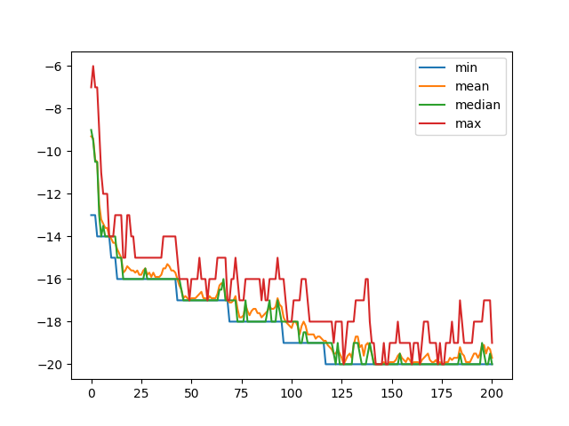
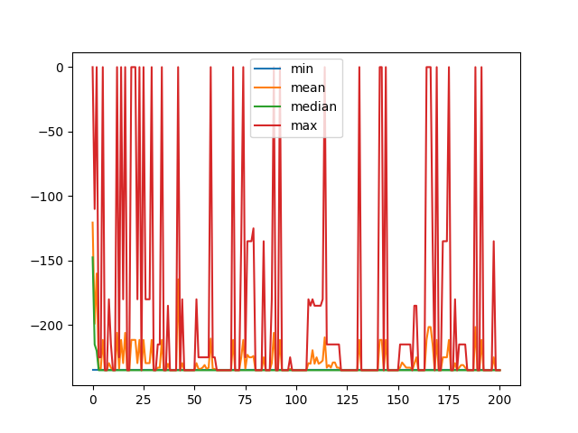
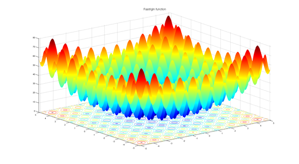
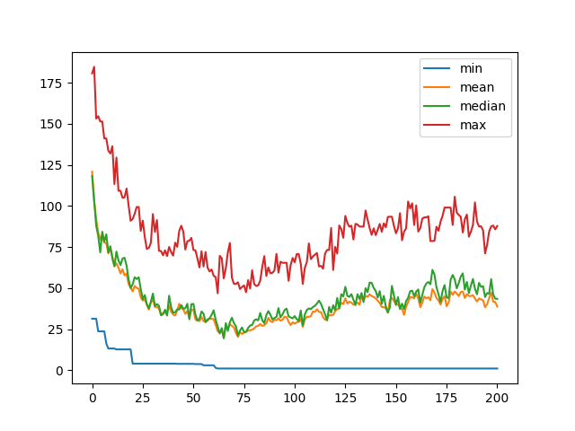
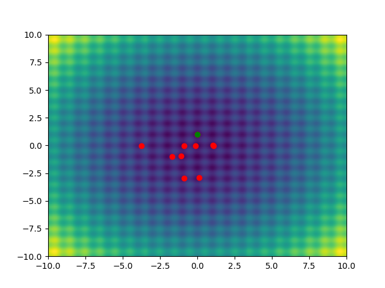
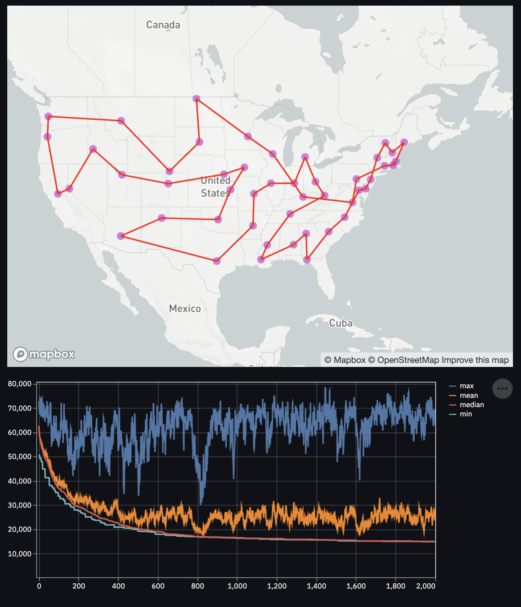
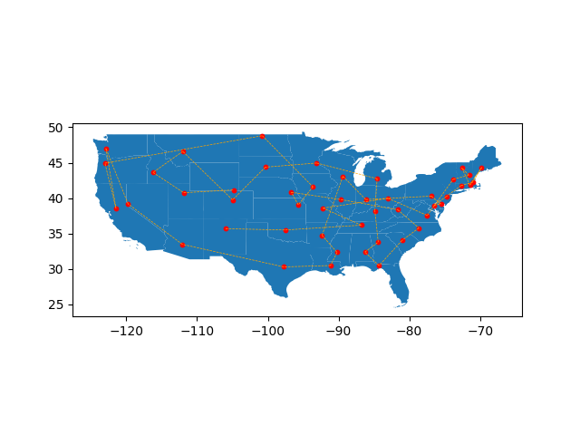
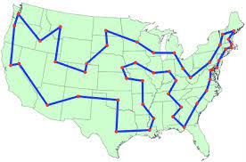

# Genetic Algorithms

## Some resources

- A good and quite complete introduction to genetic algorithms: 
  https://www.whitman.edu/Documents/Academics/Mathematics/2014/carrjk.pdf
  
- A nice step-by-step tutorial on genetic algorithms applied to the travelling salesman problem: 
  https://aws.amazon.com/blogs/machine-learning/using-genetic-algorithms-on-aws-for-optimization-problems/
  
- A theoretical proof of the convergence of genetic algorithms:
  https://www.imo.universite-paris-saclay.fr/~cerf/papers/gae.pdf
  
## Implementations

You can call the following algorithms with the CLI interface :
```
python -m algos --algorithm [continuous_optim|knapsack|one_max|tsp]
```

For the TSP you can run a dedicated steamlit app via:
```
streamlit run tsp_streamlit_app.py 
```

### OneMax problem

The OneMax problem is the following (with i between 1 and 20):


which is obviously maximised for `a_i = 1` with `maximum = 20`.

We see that the algorithm progressively decreases the objective function and converges to the solution.



### Knapsack problem

The Knapsack problem problem is the following:


To handle the constraint on the capacity, we transform the objective function such that it is equal to zero if the
constraint is not satisfied.


We see that the algorithm progressively decreases the objective function and converges to the solution, but it keeps
exploring parts of the solution space where the constraint is not verified.



### Continuous optimization

The problem is to find the (global) minimum of the Rastrigni function. It has a lot of local minimum which makes the
problem interesting.



For the crossover operation, I used the trick presented in https://www.whitman.edu/Documents/Academics/Mathematics/2014/carrjk.pdf

```
x_child_1 = (1 − β) * x_parent_1 + β * x_parent_2
x_child_2 = (1 − β) * x_parent_2 + β * x_parent_1
```

We see that the algorithm progressively decreases the objective function and explores several local minima until
finding the global minimum.





### Travelling salesman problem

The TSP problem is to minimize the total distance to do a round trip visiting each capital of the US.
We see that the algorithm progressively decreases the objective function but does not converge yet to the global 
solution.



The solution found by our algorithm has still many defaults (esp. crossing roads) but we start to see some connected
paths. To improve our algorithm we should rewrite the model formulation (e.g. breaking the symmetries) to make the
solution space exploration more efficient.






