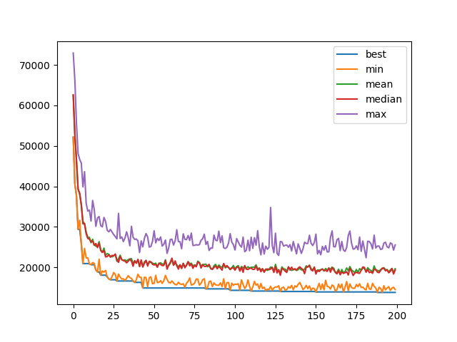

# Genetic Algorithms

[](https://genetic-algo-tsp.herokuapp.com/)

## Some resources

- A good and quite complete introduction to genetic algorithms: 
  https://www.whitman.edu/Documents/Academics/Mathematics/2014/carrjk.pdf
  
- A nice step-by-step tutorial on genetic algorithms applied to the travelling salesman problem: 
  https://aws.amazon.com/blogs/machine-learning/using-genetic-algorithms-on-aws-for-optimization-problems/
  
- A theoretical proof of the convergence of genetic algorithms:
  https://www.imo.universite-paris-saclay.fr/~cerf/papers/gae.pdf
  
## Implementations

You can call the following algorithms with the CLI interface :
```
python -m algos --algorithm [continuous_optim|knapsack|one_max|tsp]
```

For the TSP you can run a dedicated steamlit app via:
```
streamlit run tsp_streamlit_app.py 
```


### OneMax problem

The OneMax problem is the following (with i between 1 and 20):


which is obviously maximised for `a_i = 1` with `maximum = 20`.

We see that the algorithm progressively decreases the objective function and converges to the solution.


### Knapsack problem

The Knapsack problem problem is the following:


To handle the constraint on the capacity, we transform the objective function such that it is equal to zero if the
constraint is not satisfied.


We see that the algorithm progressively decreases the objective function and converges to the solution, but it keeps
exploring parts of the solution space where the constraint is not verified.


### Continuous optimization

The problem is to find the (global) minimum of the Rastrigni function. It has a lot of local minimum which makes the
problem interesting.


For the crossover operation, I used the trick presented in https://www.whitman.edu/Documents/Academics/Mathematics/2014/carrjk.pdf

```
x_child_1 = (1 − β) * x_parent_1 + β * x_parent_2
x_child_2 = (1 − β) * x_parent_2 + β * x_parent_1
```

We see that the algorithm progressively decreases the objective function and explores several local minima until
finding the global minimum.


### Travelling salesman problem

The TSP problem is to minimize the total distance to do a round trip visiting each capital of the US.
We see that the algorithm progressively decreases the objective function but seems to converge to a local optimum.

The solution found has still many defaults (esp. crossing roads) but it mostly has "continuous" paths. 
To improve our algorithm we should rewrite the model formulation (e.g. breaking the symmetries) and create other
mutation/crossover strategies to make the solution space exploration more efficient.


## Bonus part - Ant colony optimization

To go a bit further in the exploration of bio-inspired optimization techniques I also implemented some ant colony
optimization algorithms.

The Wikipedia article on [ACO](https://en.wikipedia.org/wiki/Ant_colony_optimization_algorithms) is a good introduction 
to the subject.

### Travelling salesman problem

ACO techniques apply to optimization problems that can be formulated as finding the shortest path on a weighted graph,
which is exactly the TSP formulation.

ACO gave better results, and in a much smaller amount of time, than the genetic algorithm implemented earlier on. 
Especially the tour looks quite cleaner than the genetic algorithm which had several inefficient back-and-forth.




